# Django Blog App

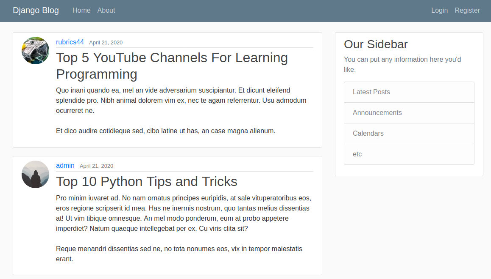

## About

This app was created following [Corey Schafer's](https://www.youtube.com/watch?v=UmljXZIypDc&list=PL-osiE80TeTtoQCKZ03TU5fNfx2UY6U4p) tutorial!

## Live Demo

[View the Live Demo](https://django-blog-386q.onrender.com/)

## Features

**_Login or Create an Account_**

<div align='center'>
  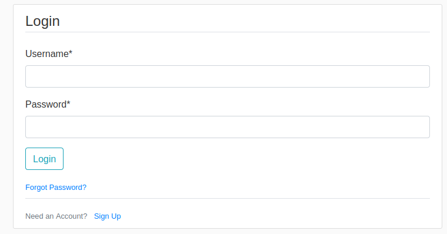
  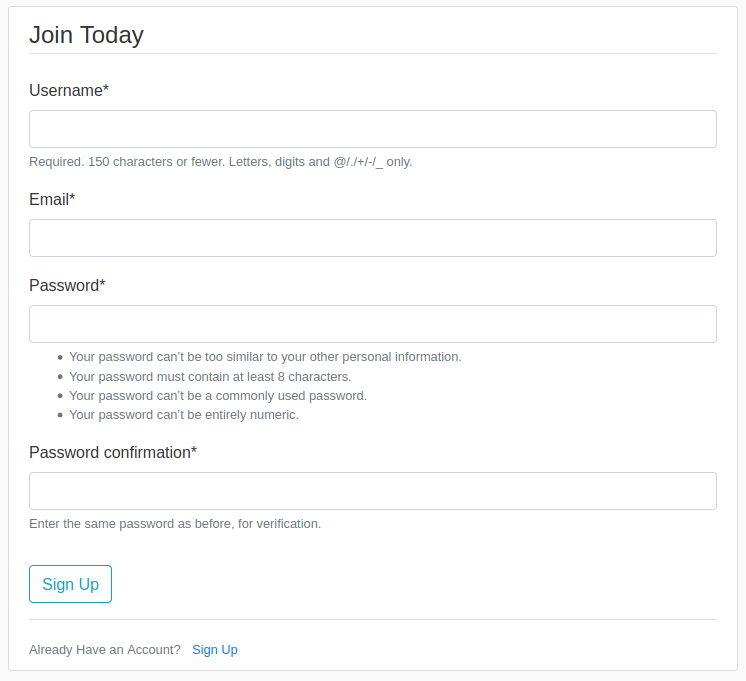
</div><br>

**_View and Customize Your Profile_**

<div align='center'>
  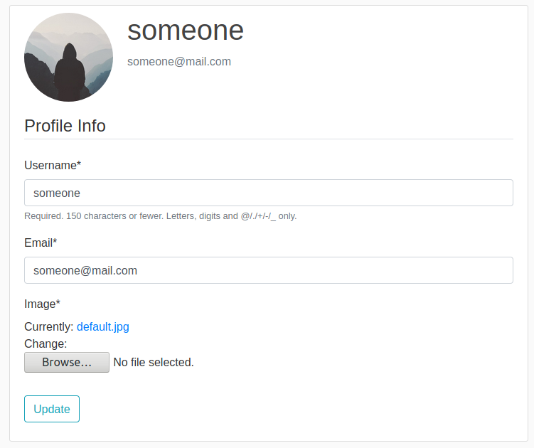
</div><br>

**_View the Articles_**

<div align='center'>
  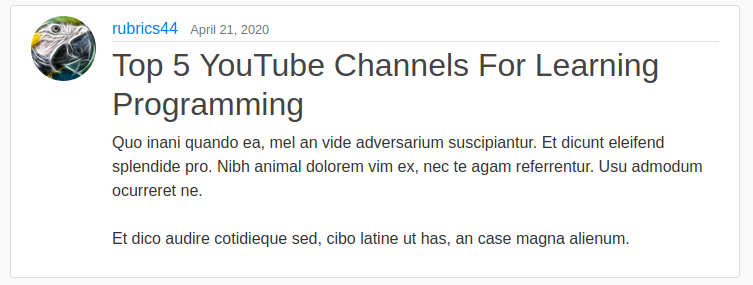
</div><br>

**_View an Authors Articles_**

<div align='center'>
  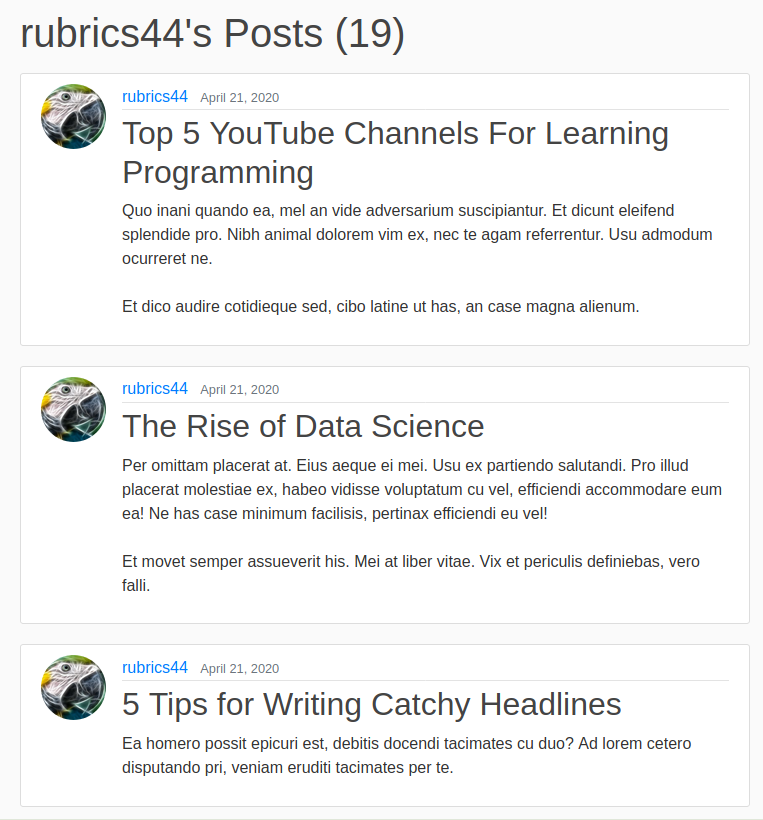
</div><br>

**_Create Your Own Articles_**

<div align='center'>
  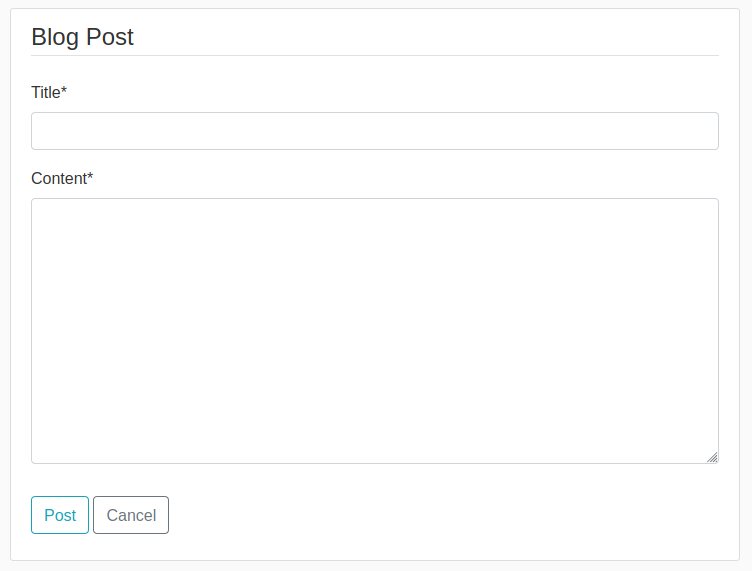
</div><br>

**_Articles are Paginated_**

<div align='center'>
  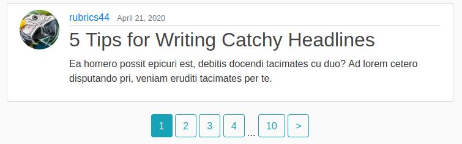
</div><br>

**_Article Author can Edit or Delete Their Article_**

<div align='center'>
  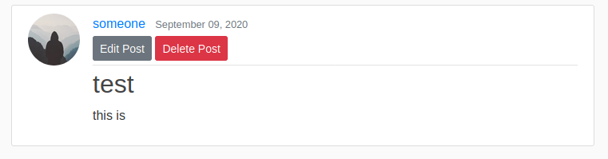
</div><br>

**_Users Password can be Reset_**

<div align='center'>
  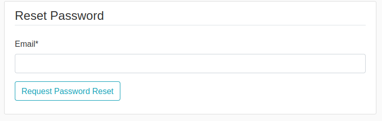
</div><br>

**_Secret Admin Panel to Manage Users and Articles_**

<div align='center'>
  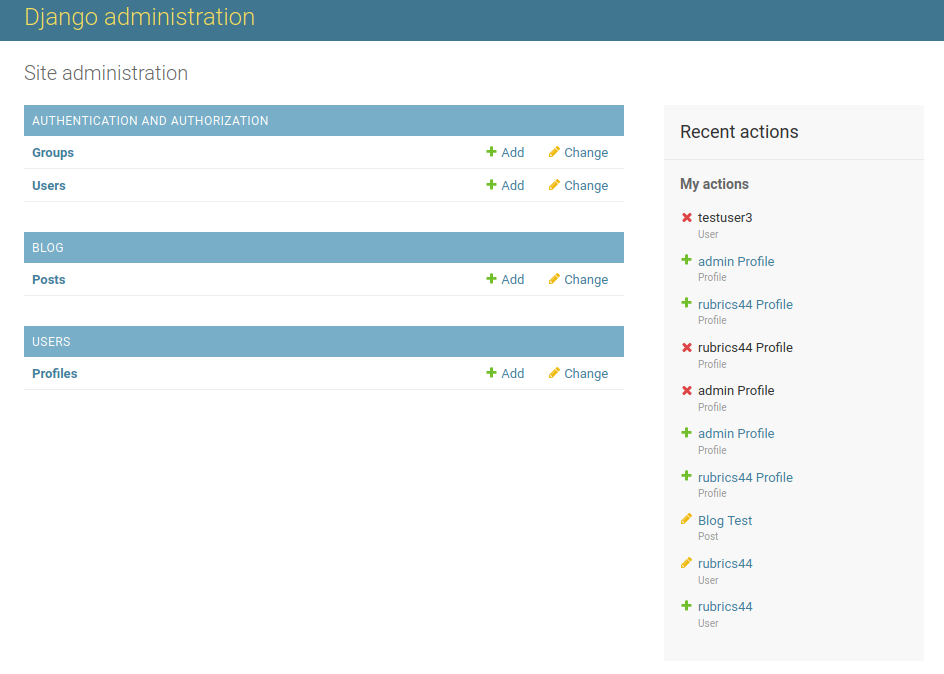
</div><br>

## Deploy the Project

**Clone the repo to your local machine using the terminal**:

```
$ git clone git@github.com:andrewbaldwin44/Django_Blog.git
```

**Deploy the Development Server**:

1. Move into the project directory `cd django_blog`
2. Create a virtual environment: `python -m venv venv`
3. Activate the virtual environment: `source venv/bin/activate`
4. Install the dependencies: `pip install -r requirements.txt`
5. Start the development server: `python manage.py runserver`

This will run the app in the development mode.<br />
Open [http://localhost:8000](http://localhost:8000) to view it in the browser.

The page will reload if you make edits.

## Technologies Used

- Python
- Django
- SQL Database
- Django Crispy Forms
- Pillow Image Management

## Author

👤 **Andrew Baldwin**

- Github: [@andrewbaldwin44](https://github.com/andrewbaldwin44)
